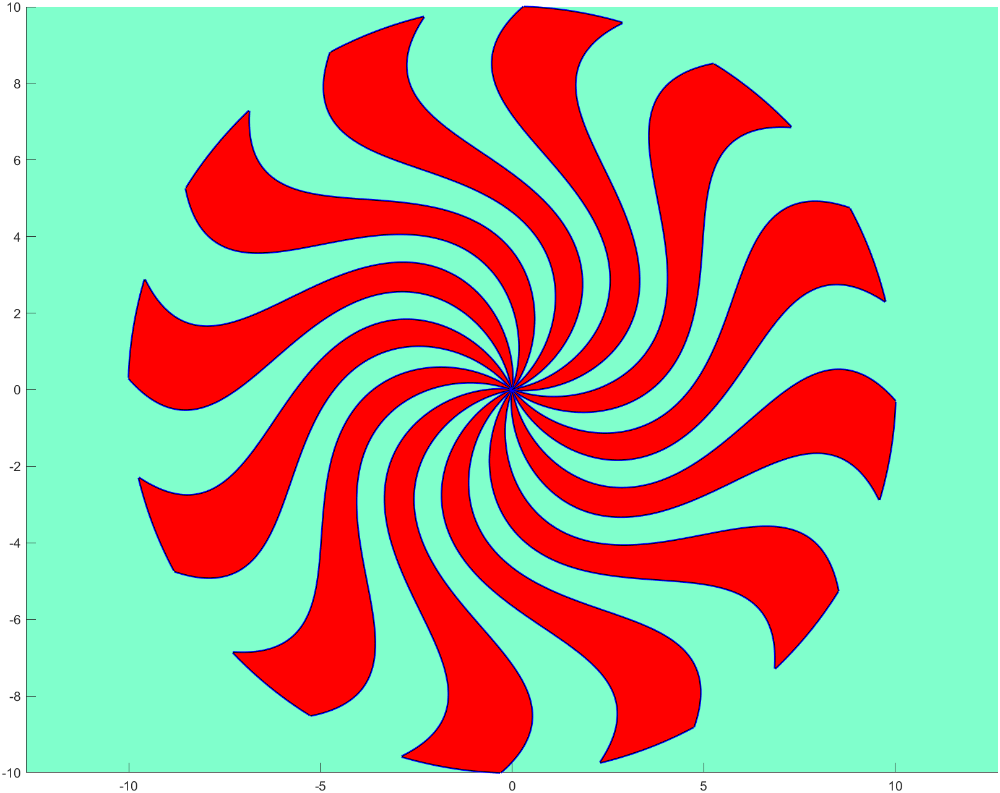

# Generating a Spiral Design Using Bezier Curves in MATLAB

## Project Description

This MATLAB project generates a visually striking spiral pattern using a combination of Bezier curves and circular base figures. The resulting image showcases the power of mathematical modeling and computational graphics in creating complex patterns. The project demonstrates how fundamental geometric shapes can be manipulated and combined to produce intricate designs. The project utilizes a custom-made MATLAB library, "anmglib_4.0," which includes basic Bezier functions.

## Table of Contents
1. [Introduction](#introduction)
2. [Installation](#installation)
3. [Usage](#usage)
4. [Code Explanation](#code-explanation)
5. [Customization](#customization)
6. [Contributing](#contributing)
7. [License](#license)

## Introduction

The goal of this project is to create an image featuring a spiral design made up of Bezier curves constructed using circular base figures. The design process involves mathematical computation of points and curves, followed by rendering the shapes with MATLAB's plotting functions.



## Installation

To run this project, you need to have MATLAB and the custom library "anmglib_4.0" installed on your system. The project files should include:
- `main.m`: The main MATLAB script that generates the spiral pattern.
- `README.md`: This readme file.
- `anmglib_4.0`: The custom library containing basic Bezier functions.

### Prerequisites

Ensure you have the following:
- MATLAB R2021a or later.
- The `anmglib_4.0` library.

## Usage

1. Clone the repository or download the project files to your local machine.
2. Ensure the `anmglib_4.0` library is in your MATLAB path.
3. Open MATLAB and navigate to the directory containing the project files.
4. Run the main script by entering the following command in the MATLAB command window:
```matlab
run('main.m')
```

This command will execute the script and display the generated spiral design.

## Code Explanation

The main script leverages functions from the `anmglib_4.0` library to generate the spiral design. Here's an explanation of the logic used in the script:

1. **Initialization and Setup:**
    - The script begins by adding the custom library to the MATLAB path and setting up the figure window with a specified background color.

2. **Generating Circle Points:**
    - The script generates a set of equidistant points along a circular path. These points, along with their derivatives, are calculated to form the basis of a Bezier curve that represents the circle.

3. **Creating Bezier Curves:**
    - Using the generated points and their derivatives, a piecewise Bezier curve is created to approximate the circle.

4. **Loading and Modifying Base Curves:**
    - A base Bezier curve definition is loaded from an external file. This base curve is then duplicated and rotated to prepare for further processing.

5. **Intersecting and Subdividing Curves:**
    - The script computes intersections between the base circle and the Bezier curves. The circle is then subdivided at these intersection points to create arcs.

6. **Joining and Incrementing Curves:**
    - The subdivided arcs and Bezier curves are joined together. To ensure smooth transitions, the degree of the curves is incremented to match each other.

7. **Generating the Spiral Pattern:**
    - The final joined object is repeated multiple times, each time rotated by a fixed angle, to create the spiral pattern. The shapes are filled with color to enhance the visual effect.

## Customization

You can customize various aspects of the spiral design by modifying the parameters in the script:
- **Number of Arms**: Change the number of iterations in the loop to increase or decrease the number of spiral arms.
- **Bezier Control Points**: Adjust the control points in the `c2_bezier_mod.db` file to alter the shape of the Bezier curves.
- **Colors and Styles**: Modify the `fill` and `set` functions to change the colors and styles of the shapes and background.

## Contributing

If you would like to contribute to this project, please fork the repository, create a new branch, and submit a pull request with your changes. Contributions are welcome!

## License

This project is licensed under the MIT License - see the LICENSE file for details.